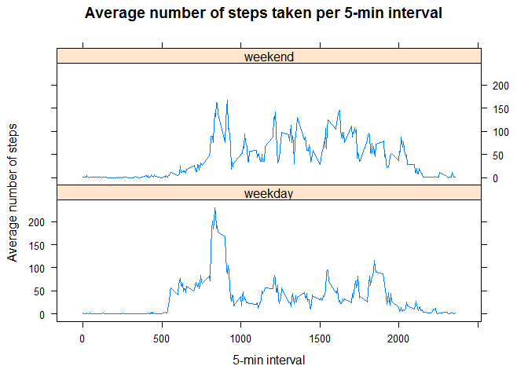

# Reproducible Research - Assignment 1

In this assignment we analyze the data from a personal activity monitoring device that recorded the number of steps at 5-minute intervals throughout the day, over the period of two months.

# Loading the data
We start by loading the `dplyr` and `lattice` packages that we will use, load the data and remove the NA values for the first part of the analysis.

```r
suppressMessages(library(dplyr))
library(lattice)
data <- read.csv("activity.csv")
cleanData <- data[complete.cases(data),]
```
The cleaned up data has the following form:

```r
head(cleanData)
```

```
##     steps       date interval
## 289     0 2012-10-02        0
## 290     0 2012-10-02        5
## 291     0 2012-10-02       10
## 292     0 2012-10-02       15
## 293     0 2012-10-02       20
## 294     0 2012-10-02       25
```

# Total number of steps taken per day
In this part we will be interested in calculating the total number of steps taken per day. We first group the data by the *date* column and calculate the sum of steps for each date:

```r
group1 <- group_by(cleanData,date)
stepSum <- as.data.frame(summarise(group1,steps=sum(steps)))
```
To vizualize the results, we make a histogram of the total number of steps taken each day:

```r
hist(stepSum$steps, main = "Total number of steps taken each day", 
     xlab = "Number of steps", col="grey", breaks=8)
```

 

Finally, we calculate the mean and the median of the total number of steps taken per day:

```r
mean(stepSum$steps)
```

```
## [1] 10766.19
```

```r
median(stepSum$steps)
```

```
## [1] 10765
```

# Average daily activity pattern
In this part we are interested in activity that happens throughout the day. We start by grouping the cleaned up data by the 5-minute intervals, and calculate the mean number of steps for each of the intervals:

```r
cleanData$interval <- factor(cleanData$interval)
group2 <- group_by(cleanData,interval)
intervalAv <- as.data.frame(summarise(group2,steps=mean(steps)))
```
Then, we convert the factor column `interval` to a numeric one (for nicer plots) and finally plot the average number of steps per interval:

```r
intervalAv$interval <- as.numeric(as.character(intervalAv$interval))
with(intervalAv,plot(interval,steps,type="l",
                     main="Average number of steps taken per 5-min interval",
                     xlab = "5-min interval", ylab = "Average number of steps"))
```

 

The 5-minute interval that, on average across all the days in the dataset, contains the maximum number of steps is:

```r
arrange(intervalAv, desc(steps))$interval[1]
```

```
## [1] 835
```

# Imputing missing values
In this part we will explore the potential bias that the presence of `NA` values may introduce into some calculations or summaries of the data. We start by looking at the total number of missing values in the dataset:

```r
sum(is.na(data$steps))
```

```
## [1] 2304
```
We choose to replace the missing values at a particular interval with their average values that we calculated in the previous part. In order to do so, we convert the *interval* column to a factor and then add a column to the dataset that contains the levels of this factor:

```r
data$interval <- factor(data$interval)
newdata <- mutate(data, intInd=as.numeric(interval))
```
We will use these levels as indices in order to extract the average values from the `intervalAv` dataset:

```r
for(i in 1:dim(newdata)[1]){
  if(is.na(newdata$steps[i])) {
    newdata$steps[i] <- intervalAv$steps[newdata$intInd[i]]
  }
}
```
As before, we group this new data by date and calculate the sum of steps for each of the group:

```r
group3 <- group_by(newdata,date)
stepSumNew <- as.data.frame(summarise(group3,steps=sum(steps)))
```
Finally, we plot the histogram:

```r
hist(stepSumNew$steps, main = "Total number of steps taken each day", 
     xlab = "Number of steps", col="grey", breaks=8)
```

 

In the original dataset typically the whole days had missing values, so by filling them with the averages we essentially added days whose sum of of steps is the same. Because of this, the only effect this imputing had on our histogram is to make the highest bar even higher. 
We can also compute the mean and the median of the total number of steps taken per day: 

```r
mean(stepSumNew$steps)
```

```
## [1] 10766.19
```

```r
median(stepSumNew$steps)
```

```
## [1] 10766.19
```
We can see how the mean has not changed, but by adding a bunch of days with the same total number of steps we brought the median to the same value of the mean. Since these values were very close before imputing, we conclude that this kind of imputing had negligible effect on this basic statistic of the total number of steps per day.

# Differences in activity patterns between weekdays and weekends
In this final part, we are interested in the difference in activity during weekdays and weekend days. To do that, we first convert the *date* column of strings to date format and add another column to the dataset that tells us what day of the week each day is:

```r
newdata$date <- as.Date(newdata$date, format = "%Y-%m-%d")
newdata <- mutate(newdata, days=weekdays(date))
```
If the day is a Sunday or a Saturday, we replace it with *weekend*, and *weekday* for the rest:

```r
newdata$days[newdata$days == "Saturday" | newdata$days == "Sunday"] <- "weekend"
newdata$days[newdata$days != "weekend"] <- "weekday"
```
We make this new column a factor, group the data by it and by the intervals, and compute the mean number of steps for each group:

```r
newdata$days <- as.factor(newdata$days)
group4 <- group_by(newdata,interval,days)
intervalAvNew <- as.data.frame(summarise(group4,steps=mean(steps)))
```
Finally, we plot the average number of steps per interval for weekdays and weekends separately:

```r
intervalAvNew$interval <- as.numeric(as.character(intervalAvNew$interval))
xyplot(steps ~ interval | days, data = intervalAvNew, layout = c(1, 2),
       type="l",main="Average number of steps taken per 5-min interval",
       xlab = "5-min interval", ylab = "Average number of steps")
```

 
